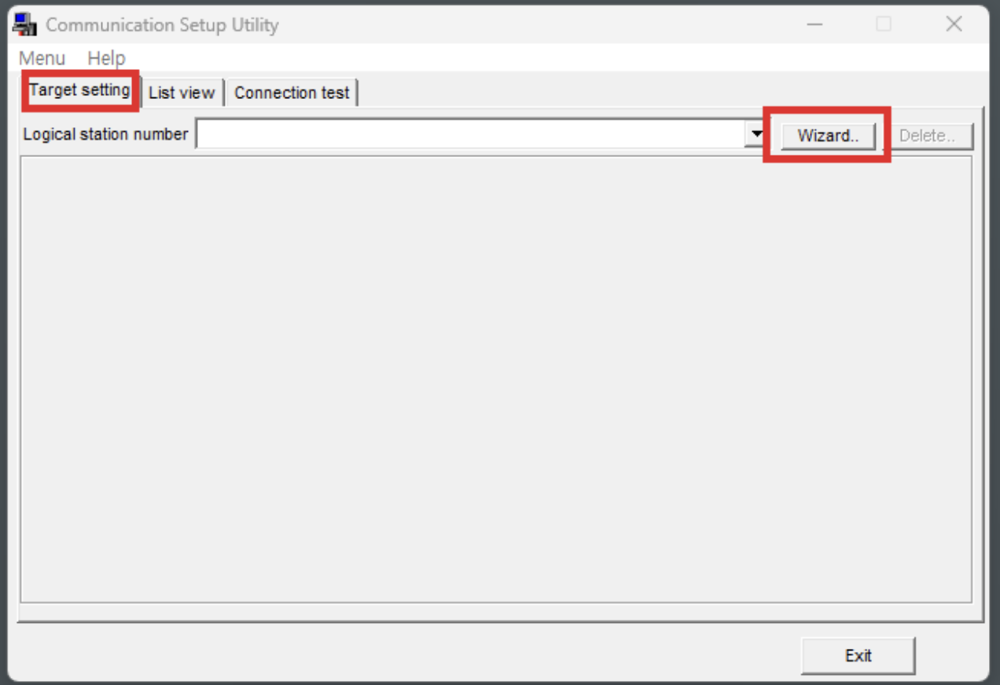
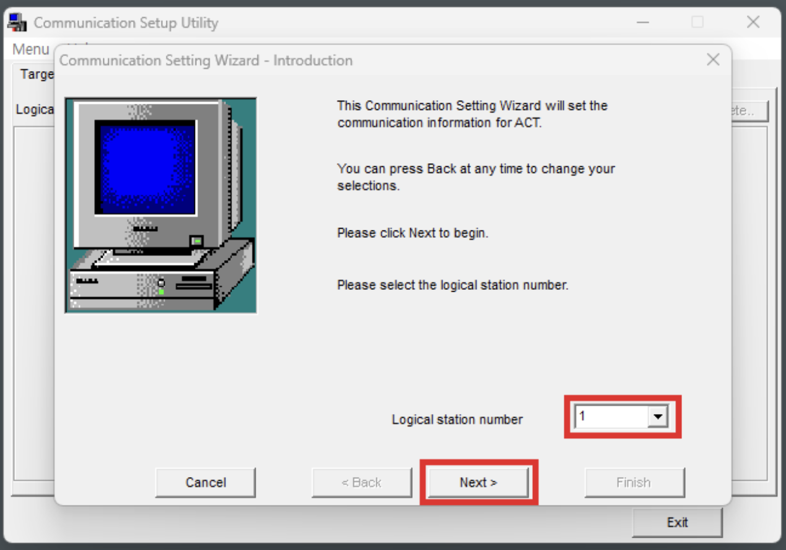
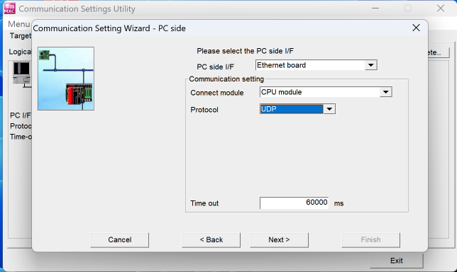
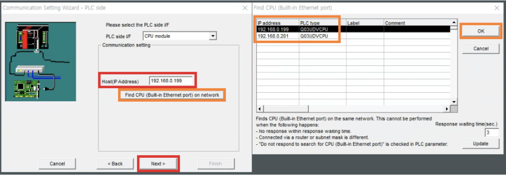
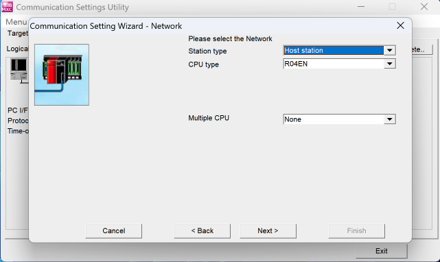
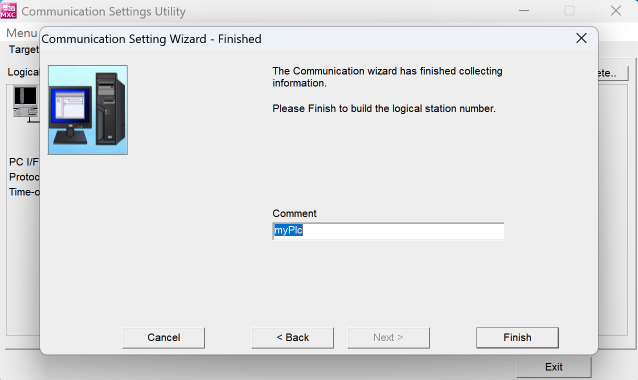
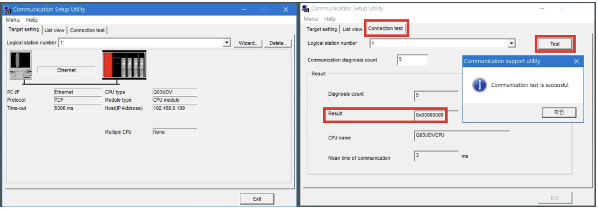

# MES_Project

## 1. MX component 사용법

- Target setting탭의 wizard를 선택

- Logical station number는 중복된지 않는 숫자로 입력

- Ethernet board / CPU module / UDP를 선택

- Find CPU를 진행시 해당 PLC의 IP를 조회를 진행 할 수 있으며, 선택진행

- CPU type을 연결하고자 하는 PLC CPU모델을 입력 진행

- 지금까지 진행된 PLC 연결 포트의 대한 이름 지정

- Connection test 탭의 방금 만든 station 번호를 선택후 test진행 연결이 되었다면 완료

